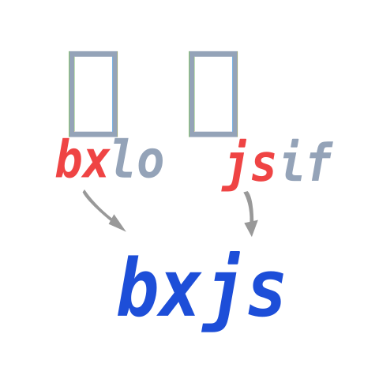
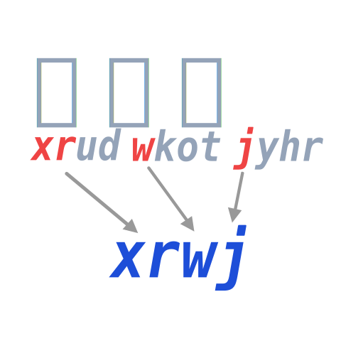
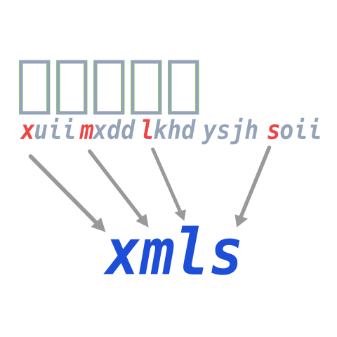

# 词语输入
 有了单字的输入，词组输入非常简单

## 两字词

两字词 ＝ **第一字的前两码 ＋ 第二字的前两码**

比如，输入“编辑”

编 `bxlo`，辑 `jsif`，取各自的前两码：编辑 `bxjs`

## 三字词
三字词 ＝ **第一字的前两码 ＋ 第二字的第一码 ＋ 第三字的第一码**

比如，输入“显微镜”

显 `xrud`，微 `wkot`，镜 `jyhr`：显微镜 `xrwj`

## 多字词
四字及四字以上词 ＝ **第一字的第一码＋第二字的第一码＋第三字的第一码＋最后一字的第一码**

比如，输入“老马识途”

老 `lfww`，马 `mxdd`，识 `slim`，途 `tjnn`：老马识途 `lmst`

再比如，输入“喜马拉雅山”

喜 `xuii`，马 `mxdd`，拉 `lkhd`，雅 `ysjh`，山 `soii`：喜马拉雅山 `xmls`

