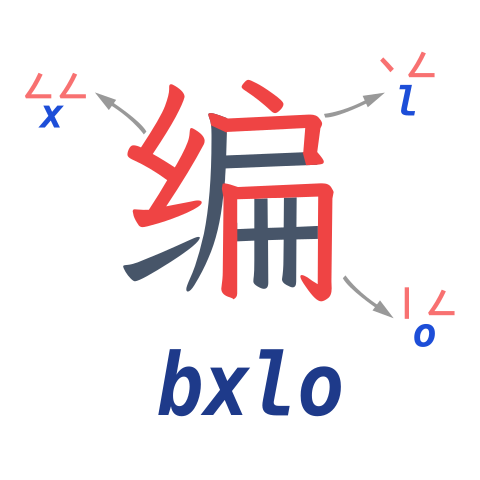
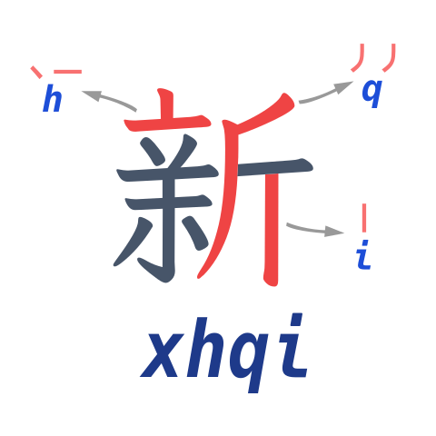
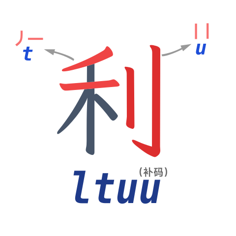
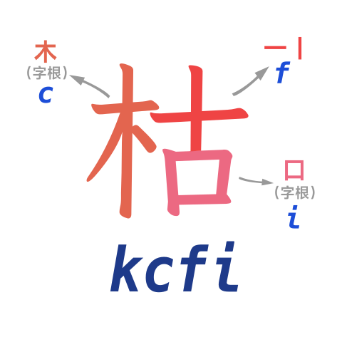

# 拆字示范
哲豆里的每个字，完整编码是4个字母。

## 多个部件的字：编
我们试试打个【编】字。

1. 编的拼音是 `bian`，拼音首字母是 `b`，故第一码是 `b`。
2. 两分法，把【编】拆成【纟】和【扁】.
   1. 第二码，形码，【纟】的前两笔，即“ㄥㄥ”，`x`
   2. 第三码，形码，【扁】的前两笔，即“丶ㄥ”，`l`
3. 再一次两分法，为了得出第四码，【扁】拆成【户】和【𠕁】。字根再拆有个高档的名字——“再分阴阳”。
   1. 第四码，形码，【𠕁】的前两笔，即“丨ㄥ”，`o`
4. 所以，编的完整编码是 `bxlo`，如图：

## 最后一笔：新
这回试试打个【新】字

1. 第一码：音码 `x`
2. 两分法，把【新】拆成【亲】和【斤】
   1. 第二码，【亲】的前两笔，即“丶一”，`h`
   2. 第三码，【斤】的前两笔，即“丿丿”，`q`
3. 第四码出现问题了，【斤】字不能拆为两部分了，这种不能拆的字叫 **独体字**。之前【扁】字是可以拆的，叫 **合体字**。
   1. 第四码，【斤】是独体字，取末笔“丨”，`i`
4. 综上，【新】的编码是 `xhqi`

## 连击补足：利
1. 第一码：音码 `l`
2. 两分法，【利】拆成【禾】【刂】
    1. 第二码，【禾】的前两笔，丿一，`t`
    2. 第三码，【刂】的前两笔，丨丨，`u`
 3. 【刂】只有两笔，不是独体字，没有末笔怎么办？我们要补齐四码：
    1. 第四码，重复上一码，`u`
 4. 综上，【利】的四码编码是 `ltuu`

## 独体字：用
1. 第一码：音码 `y`
2. 【用】是独体字，处理方法如下：
   1. 第二码，【用】字的前两笔，丿ㄥ，`w`
   2. 第三码，【用】字的末笔，丨，`i`
   3. 第四码，补码，重复上一码，`i`
3. 综上，【用】的全码是 `ywii`。

## 两个笔画的独体字：十
1. 第一码：音码 `s`
2. 【十】只有两笔，就不用末笔，不停重复第二码即可：
   1. 第二码，【十】的前两笔，一丨，`f`
   2. 第三码，补码，重复上一码，`f`
   3. 第四码，补码，重复上一码，`f`
3. 综上，【十】的全码是 `sfff`

## 一个笔画的字：乙
1. 第一码：音码 `y`
2. 【乙】字一笔写完，形码就打 ㄥ，后面全是补码：
   1. 第二码，【乙】的笔画，ㄥ，`c`
   2. 第三码，补码，重复上一码，`c`
   3. 第四码，补码，重复上一码，`c`
3. 综上，【乙】的全码是 `yccc`

## 有特殊字根的字：枯
为了快捷增效，哲豆设置了14个无理的字根，遇到它们就打它们，代替两笔了。

1. 第一码：音码 `k`
2. 形码部分，【枯】两分成【木】【古】，而【古】又能再分阴阳成【十】【口】
   1. 第二码：【木】字根，`c`
   2. 第三码：【十】的前两笔，一丨，`f`
   3. 第四码：【口】字根，`i`
3. 综上，【枯】字的编码是 `kcfi`

